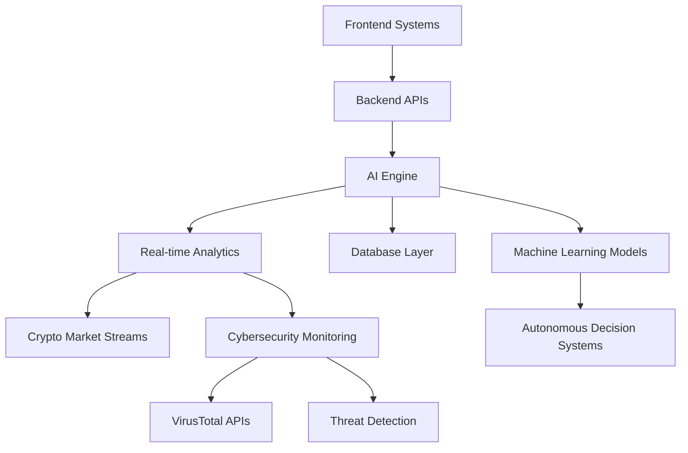

<div align="center">


<br/>


<br/>


</div>


<p align="center">
  
</p>

# 🪪 DIGITAL IDENTITY

<div align="center">

<table>
<tr>
<td width="50%">

```yaml
NAME: Abdul Rafay
ALIAS: CharlieFour
ROLE: Software Engineer

SPECIALIZATION:
  - Artificial Intelligence
  - Cybersecurity
  - Game Development
  - E-Sports Infrastructure
  - System Architecture

CURRENT_STATUS: BUILDING_THE_FUTURE
LOCATION: Pakistan
```

</td>

<td width="50%">

```yaml
SYSTEM_CORE:
  LANGUAGE:
    - C#
    - Python
    - C++
    - JavaScript

  FOCUS:
    - AI Trading Systems
    - Antivirus Engineering
    - Unreal Engine 5
    - Competitive Gaming
    - Cloud Infrastructure

  MODE: ACTIVE
```

</td>
</tr>
</table>

</div>

---


# ⚡ SYSTEM STATUS

<div align="center">

<table>
<tr>
<td width="33%">

### 🤖 AI CORE

```diff
+ STATUS: ONLINE
+ TRAINING MODE: ACTIVE
+ AGENTS: DEVELOPING
+ PIPELINES: RUNNING
```

</td>

<td width="33%">

### 🛡 CYBER SECURITY

```diff
+ WATCHDOGS AV
+ REAL-TIME MONITORING
+ HASH ANALYSIS
+ NETWORK INSPECTION
```

</td>

<td width="33%">

### 🎮 GAME SYSTEMS

```diff
+ UNREAL ENGINE 5
+ WORLD BUILDING
+ MULTIPLAYER SYSTEMS
+ CINEMATIC DESIGN
```

</td>
</tr>
</table>

</div>

---


# 🧬 TECH ECOSYSTEM

<div align="center">


</div>

---

# 🎮 GAME DEVELOPMENT MATRIX

<div align="center">

| ENGINE / TOOL | EXPERIENCE | SPECIALIZATION |
|---|---|---|
| Unreal Engine 5 | █████░░░░░ | Multiplayer Systems |
| Godot | ████████░░ | Indie Prototyping |
| Blender | ████████░░ | Environment Design |
| Figma | ████████░░ | UI / UX Systems |
| AI Integration | ███████░░░ | Intelligent Gameplay |

</div>

---


# 🚀 ACTIVE MISSIONS

<div align="center">
<table>
<tr>
<td width="50%" valign="top">

# 🎮 Game Dev

```diff
+ STATUS: ACTIVE
+ TYPE: Story Mode
+ STACK: Unreal Engine 5
+ FEATURES:
    + Advanture
    + Story Rich
    + Split Screen
```

</td>

<td width="50%" valign="top">

# 🤖 Artificial Crypto

```diff
+ STATUS: IN DEVELOPMENT
+ TYPE: Simulated Crypto Exchange
+ FEATURES:
    + Wallet Authentication
    + AI Trading Agents
    + Referral Systems
    + Real-time Market Logic
```

</td>
</tr>

<tr>
<td width="50%" valign="top">

# 🎮 E-Sports Pakistan

```diff
+ STATUS: EXPANDING
+ ROLE: OPERATIONS & INFRASTRUCTURE
+ FOCUS:
    + Tournament Systems
    + Team Management
    + National Competitive Scene
```

</td>

<td width="50%" valign="top">

# 🏛 E-Sports of Club Bahria

```diff
+ ROLE: PRESIDENT
+ OPERATIONS: ACTIVE
+ RESPONSIBILITIES:
    + Event Management
    + Community Growth
    + Cross-University Leagues
```

</td>
</tr>
</table>

</div>


---


# 🧠 AI SYSTEM ARCHITECTURE



---

# 📊 GITHUB TELEMETRY

<div align="center">


</div>

---

# 📈 CONTRIBUTION MATRIX

<div align="center">


</div>

---

# 🏆 ACHIEVEMENTS

<div align="center">


</div>


---

# 📡 ESTABLISH CONNECTION

<div align="center">

[](https://linkedin.com/in/abdul-rafay-58265b2a9)

&nbsp;

[](mailto:rafay0820188@gmail.com)

&nbsp;

[](https://github.com/charliefour)

</div>

---

# 💻 TERMINAL

<div align="center">

```bash
> initializing secure connection...
> decrypting communication channel...
> AI systems synchronized
> cybersecurity modules active
> esports network connected
> STATUS: OPEN TO COLLABORATE ✅
```

</div>

---

<div align="center">


</div>
